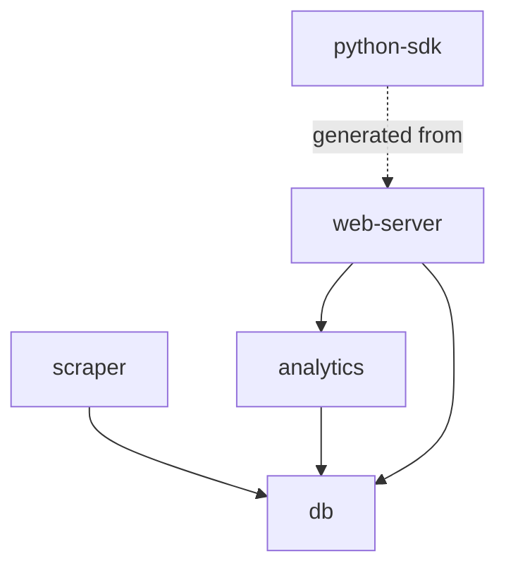

Python isn't my favorite language, but as of 2025, it remains undeniably the world's most popular programming language.

The irony? My biggest criticism of Python—its historically weak type system—is the same reason for its dominance.
Developers love Python for its simplicity and versatility,
even if large-scale projects can become maintenance nightmares when written by non-professionals.
In this post, I'll share modern Python practices to help avoid these pitfalls.

## TL;DR

- Environment/Dependency Management: Replace `conda`/`pip` with `uv`
- Monorepos: Use `uv` workspaces for multi-component projects
- Code Quality: Adopt `ruff` for linting/formatting
- Maintainability: Enforce type annotations across functions calls and module boundaries

## Environment

Python newbies usually use `python` command directly, but it's not a good practice.

Using virtual environment is the best practice for Python projects.

Some options include:

- `pyenv`
- `virtualenv`
- Anaconda

My previous go-to tool is anaconda, because I can easily share environment across projects, I don't need a complete new environment for each project.
But it's too heavy for most projects.

`uv` is a modern package manager built with Rust, it's faster and more efficient.

It automatically creates a virtual environment for each project, and it's very easy to switch between different versions of Python.

### Package Management

`pip` is the default package manager for Python, but it's not the best. There are many alternatives.

`uv` is a modern package manager that is faster and more efficient.
Its syntax is similar to `npm`. `uv add <package>` is equivalent to `npm install <package>`.

```bash
# Create a virtual env + install packages (like npm install)
uv venv  # Creates .venv
uv add requests pandas  # Installs + updates pyproject.toml
```

The dependencies are stored in `pyproject.toml` file instead of `requirements.txt` or `environment.yml`.

`uv`'s install speed is much faster than `pip` or `conda`.

Setting up the environment for a Python project is usually a pain, even if they provide `requirements.txt` or `environment.yml`.

There could be all kinds of issues, e.g. dependency conflicts, incompatible dependency/python versions, etc.

`uv`'s environment management is much more robust and easier to use, and it's incredibly fast.

## Workspaces

One thing I observed from Python newbies is that they write all code in a single Python project.
This is fine for POC or small projects that involve only one component.
But in a large project, there may be multiple components, e.g. a shared library, a CLI, a web scraper, multiple microservices, etc.

Yes, you can write all code in a single project, but it's hard to maintain.

Some potential problems include:

- Spaghetti import statements, causing circular dependencies
- Different versions of a dependency in different components
- Hard to test as a single module
- Hard to package and publish each component separately

`uv`'s workspaces feature is designed to solve this problem.
Kind of like monorepos in the JS ecosystem. Like NX, TurboRepo, etc.

You can create multiple workspaces in a single repository, and each workspace can have its own dependencies, tools, etc.
Then each workspace can be packaged and published separately. They can also import each other's modules.

Let me give you an example:

- We need to scrape data from websites and store them in a database
- An analytics service is run as a cron job to analyze the data and store to the database
- We need to build a web app to visualize the data
- A web server is used to serve the web app and data APIs
- A Python client sdk is published for clients to use, but all other modules are private

We can create 5 workspaces in this repo:

- `db`: for accessing database
- `scraper`: for scraping data
- `analytics`: for analytics service
- `web-server`: for web server
- `python-sdk`: for Python client sdk

Each workspace can have its own dependencies, tools, etc.

- The `db` package is a shared library for accessing the database, it will contain ORM, DAO, etc.
- The `scraper` scrapes websites and stores the data in the database with `db`
- The `analytics` service read and write data from the database with `db`
- The `web-server` is a web server that serves the web app and data APIs, it will use `analytics` for some realtime analytics and serve data by reading from DB with `db`
- The `python-sdk` is a Python client sdk for clients to use. `web-server` should generate an OpenAPI spec, and `python-sdk` should be generated from the spec.
  - `python-sdk` is published to PyPI, and can be installed by `pip install <python-sdk>`

Here's a visualization of how these workspaces depend on each other:



The solid arrows represent direct dependencies (imports), while the dotted arrow shows that the Python SDK is generated from the web server's OpenAPI spec.

## Linting & formatting

ruff has made legacy tools obsolete. It's:

- 10-100x faster than flake8 + black
- A single dependency (`uv add --dev ruff`)
- Configurable via pyproject.toml

```bash
# Format + lint all in one (and fix automatically!)
ruff check --fix
ruff format
```

## Type Enforcement

Type enforcement includes type annotations and type checking/validation.

Python is a dynamically typed language, but it's not a good practice to write code without type annotations.

It's easier to write Python code without type annotations; it's also easier to write bugs without type annotations.

### Rule of thumb

- Always validate input data when reading from external sources, e.g. databases (if the database schema is not enforced by the ORM/DB sdk), JSON files, web requests, etc.
- Always annotate function parameters and return values within modules
- It's Okay to use a `dict` without type annotations, only when it's used within a function

### Tools

- Data Validation
  - `pyright` - Static type checker
  - `pydantic` - Runtime data validation
  - `pandera` - Data validation for pandas DataFrames
- Type Annotations
  - `dataclass` - Class decorator for data classes
  - `TypedDict` - Type hints for dictionaries
  - `typing` - Built-in type hints (List, Dict, Optional etc)

One thing I often see in ML projects is that people passing `dict` or `list` everywhere.
Without reading through the code, you don't know what they contain.
Sometimes I have to use Python debugger to find out what's inside.

### Type Checking

For example, the following code has wrong year type. It should be `int` instead of `str`.

`mypy hello.py` should report an error.

If VSCode doesn't show any error, go to settings and set `Python > Analysis: Type Checking Mode` to `basic` or `strict`.

```py title="hello.py"
from typing import TypedDict

Movie = TypedDict("Movie", {"name": str, "year": int})
m: Movie = {"name": "The Dark Knight", "year": "2008"}
```

Within a function, where one can easily remember the context, it's fine to use `dict` without type annotations.

But once the variable left the function scope, it should be annotated.

```py title="hello.py"
def get_related_movies(movie: Movie) -> list[Movie]:
    # do something with movie
    pass

related_movies = get_related_movies(m)
```

The idea is simple, within the function scope, it can be like a black box.
But the input and output must be annotated, so anyone using this function knows how to use it and what it returns without reading the code.

### Type Validation

For data coming from web requests, you cannot assume it has the right type. Always parse/validate it.
For example, for a web app, even if you write the frontend and know the data type, people could send wrong data with `curl` or code.
And if your backend API changed but frontend didn't update, it could cause problems.

I usually use `pydantic` for this.

```python
from datetime import datetime

from pydantic import BaseModel, PositiveInt


class User(BaseModel):
    id: int
    name: str = 'John Doe'
    signup_ts: datetime | None
    tastes: dict[str, PositiveInt]
```

Not only web server, when you fetch data from some APIs or scrape data from websites, you should validate the data,
unless you are using protocols like gRPC or GraphQL which are already strongly typed.
Their API spec may be wrong and return wrong data, and you don't want to crash your server.

### `pandas`

`pandas` is a powerful tool for data manipulation, but it's not type safe.

It's convenient to pass `pd.DataFrame` around, but it's not a good practice, especially across modules.

Validating a large `DataFrame` could be slow.
When performance is critical,
at least write comments to describe what columns are expected for the input `DataFrame` and what the expected data type is.

Use `pandera` for `DataFrame` validation.

If you publish a package and have to return `pd.DataFrame`,
at least also export `pandera` schemas so users can choose to validate the data.

If performance is not a concern, you can convert the `DataFrame` to dataclasses or typed dictionaries before passing it around.
They can always be converted back to `DataFrame` when needed.
