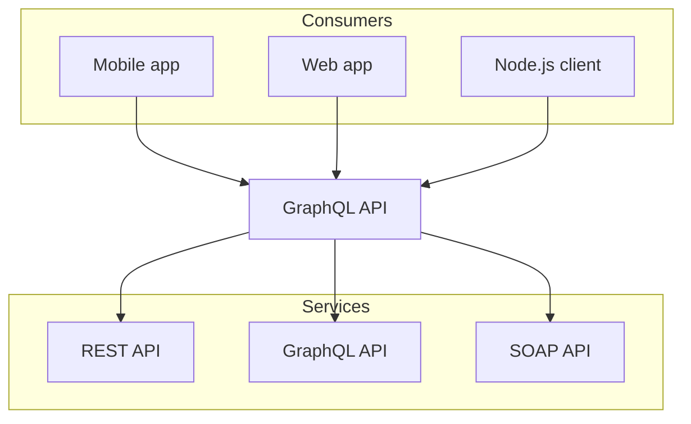

## Code Block

```js
console.log('Hello World');
```


$1+1=2$

```math
c = \pm\sqrt{a^2 + b^2}
```

## Cards

<Cards>
  <Card title="Learn more about Next.js" href="https://nextjs.org/docs" />
  <Card title="Learn more about Fumadocs" href="https://fumadocs.vercel.app" />
</Cards>

```rust
use applications;

```


